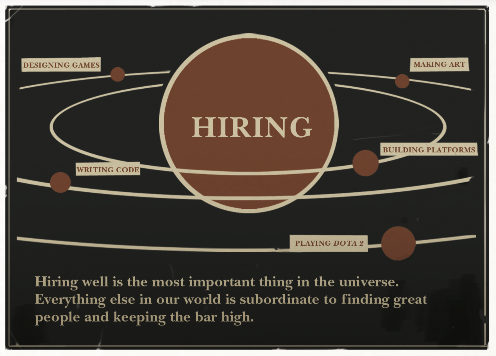

Hiring is the most important thing you'll do as a manager. It's more important than the quality of your code, more essential than your product strategy and even more critical than how much money you have in the bank. Don't take it [from me](http://cdn.fastly.steamstatic.com/apps/valve/Valve_NewEmployeeHandbook.pdf).

> Hiring well is the most important thing in the universe. Nothing else comes close. It’s more important than breathing. So when you’re working on hiring—participating in an interview loop or innovating in the general area of recruiting—everything else you could be doing is stupid and should be ignored!

You probably heard this but it's worth repeating. Hiring is largely a numbers name: you want more shots at the goal. However, especially as a small company, you don't have a lot of resources to simply keep shooting, you need surgical precision. There are two strategies that I've seen work. The first is referrals. And the second is an approach I've come to call "tags".

## Referrals

The best hires will always come from referrals. The key here is to be mechanical. At most small companies, 

## Building a Pipelien

 working really hard on generating the largest list of candidates from the most specific seeds. I mentally think of each of these seeds as a tag. Don't ask why I need that level of indirection.

Let's say you want to hire a backend engineer. The first thing you want do is write a good job description. This is not because you'll hire someone who applies; most likely you won't. However, writing a good job description will force you to put down in paper how you'll both narrow down and go deep in your search. 

The goal is to increase the number of "tags" — the aforementioned seeds you'll use to start your search from.

A good job description will include key elements:

- Technical requirements for the job such familiarity with your tech stack,
- Years of experience the candidate will need,
- The industry you are in such as finance, environment, or crypto,
- Other logistical details such as location that might be important to you.

Again, do not skip this step. The more detailed you can be, the more tags you'll get. For example, if you are hiring a backend engineer to work on your Elixir code, make sure to list Elixir. If your system uses Phoenix, include that as well as Elixir. And the same idea applies to other types of "tags" as well. Working in "fintech" is a good start, but if you are focused on, say, payments, mention that too. And if you are working on cross-border payments, that's even better.

