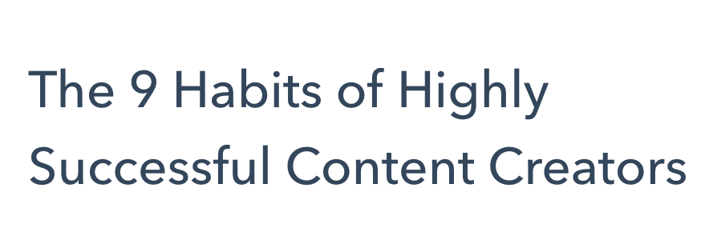
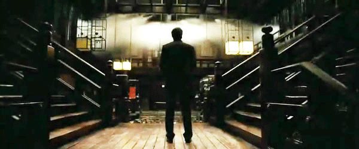
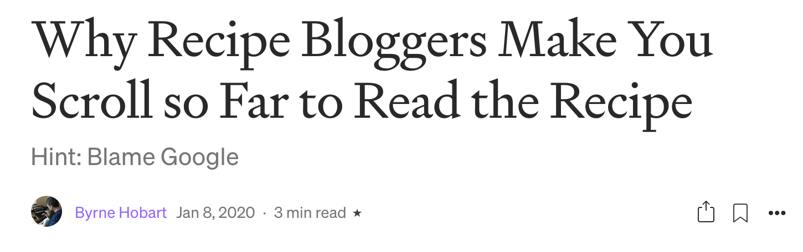

import Callout from '@/components/Callout.astro'

<Callout variant="note">
This post was originally published on [Margins](https://www.readmargins.com) in January 2021.
</Callout>

Hi! Can here. This week, I ramble like I never did before about this whole ~ content ~ business. You have been warned!

My co-host Ranjan and I met through a cold-email I sent many years ago when I was a fresh-faced, green-eyed optimist who was sure that if I could code the right thing, I'd help save journalism via technology. He had since then moved past his delusions of techbro grandeur but we realized we had plenty of similar obsessions and immediately clicked. Since then, we'd been practically chatting all day on Slack for years. So, you'd be surprised when I tell you that I still don't know what Ranjan does, day to day. I know he works in content, and he does content stuff, and I know what content is, in some abstract and theoretical way, but I don't fully understand what it means to be working in content. In fact, I don't even know what content is!

Obviously, the irony of that statement is not lost on me. For most of you, I am nothing but a content creator. In fact, it might even be simpler to say that most people know me as content than the living and breathing person I am. Am I content? If I am content, does that also mean I am content? Should I be content with being content?

Ahh. I think there are a couple of things at play when I say I don't "get" content.

## Consumption is Good, Actually

One is what it means to "consume" content, and what that word, consumption, implies. One idea that I always had trouble digesting is that consumption is an additive activity, rather than an extractive one. For example, you always hear we are a consumption-based economy and how it is fundamentally a good thing. When the consumption is down, for example, the governments get all worked up and they try to stimulate it as much as they can. One of the most important metrics that everyone from the most theoretical economist to the Robinhood day traders high off on [r/WSB](https://www.reddit.com/r/wallstreetbets/) follows is the [CPI](https://en.wikipedia.org/wiki/Consumer_price_index), the consumer price index. As divided and different as we might be, most of us can find some solace in that we are all in this consumption stuff together.

So, in that sense, consumption is a good thing. Consumption begets production, which means jobs and growth and all that associated goodness. While I do understand and appreciate the mechanics of all this, maybe due to the fact we seem to be living on a planet with limited and fast dwindling resources, some part of the equation always felt a bit off. At least to my Turkish ears, it seemed like the more you "consumed" something, the less of it you'd end up with. Yet, obviously, it's the opposite that happens.

### I don't even…

And, there's something even more cynical, if not sinister, about how so much of the content seems to be created not to have been created, but to be consumed. I know this sort of divulges into the age-old question of "art for art's sake" but I can't shake this feeling that so much of what gets generated as content is solely for consumption. Whether it comes in the form of a quick TikTok dance or a jaded-techie blabbering on a Substack, most content seems to originate not to exist, let alone persist for more than a few minutes at most. And we all seem to be content (hah!) with this [reductio ad absurdum](https://en.wikipedia.org/wiki/Reductio_ad_absurdum) of [planned obsolescence](https://en.wikipedia.org/wiki/Planned_obsolescence).

In fact, maybe the content creation industry is the true hallmark of late-stage capitalism more than anything and we should instead celebrate this milestone in the advancement of our civilization. There's no marginal cost, for example, to create another piece of content from the perspective of who is making a profit from it. Sure, you have to occasionally share some of the proceeds to incentivize the masses, but for the most part, once you get the engine running and have it well-oiled with whatever conflict that seems to rile people up that day, you can just sit back and enjoy the gains. Journalism might be dying a slow death, but there's no business like content business.

## Content Gets in Everything

And that brings me to my other beef. If you work in the "content" business, or even watch it from the sidelines as I've been doing for more than a decade, you soon realize what people mean when they say they "create content" is actually less about creating, but more about generating. While the word derivative is almost a pejorative in the arts, in the world of content, it is what pays the bills. Sure, creativity is rewarded here and there, but most of the money flow is in the derivatives, those who create, I mean generate, stuff to satisfy the demand gods, whatever they happen to be.

I know I am being a bit abstract here, so let me take a step back. A while ago, Ranjan and I were discussing ways to describe the impact of [Zero Interest Rate Policy](https://en.wikipedia.org/wiki/Zero_interest-rate_policy). The way I always imagined is akin to a huge, insane amount of liquid money sloshing around, not just finding the path of least resistance but also getting into every nook and cranny in the meantime too. And when that happens, things start to break in weird ways. You, for example, end up with tens of thousands of bikes lying around in cities first, only to be then discarded en masse. Others, like Ranjan, find ways to take a bite (or dip into?) that giant slosh by doing some gastro-arbitrage.

While I was arguably a benefactor of that giant pool of money sloshing around, that is also exactly how I feel about the world of content as well. The analogy isn't perfect (as most analogies aren't) but it rings true. So much of the content in the world seems to be generated to add one more nook for that slurry of eyeballs and SEO traffic to seep into. This is why, for example, every single recipe site sucks now. Since Google (let's be real, there's really one search engine in the Western world, ahhhh!) prefers websites to have "original" and "recently updated" "content" (please read every single quote as me rolling my eyes), you end up with people plastering recipe pages, which in an otherwise efficient world would be the easiest things to index as they are nothing but algorithms, with the blandest, drab content.

And that's just the most inane example. The eyeball and SEO sludge that feeds off the content, to make a tired but oddly appropriate pun, is never content. And the more sinister thing of it all is the monster does reward, initially, pretty well. But once you are in for a penny, you are in for a pound and a bitcoin and a half. Whether it's the dopamine in your veins or the [Chartbeat](https://chartbeat.com/) needles pointing up and right on your dashboard, once you experience the sweetness of the content slurry, there's no going back.

Maybe now that I have spent more than 2 decades being online, if not too much online, I'm a crotchety old man who just does not get it. And I already know I'm a huge hypocrite by not just creating this content you are all enjoying (I hope?) but also consuming it day and night on the most ephemeral of all mediums that is Twitter. Every once in a while when I go do an intermittent Twitter fast, I am reminded how fast the memes and narratives come and go. Stay away from it, for example, a week or so, and half the conversation becomes indecipherable. Such is the way of content on the pulse of the world. Maybe that's something I should just...be content with.
