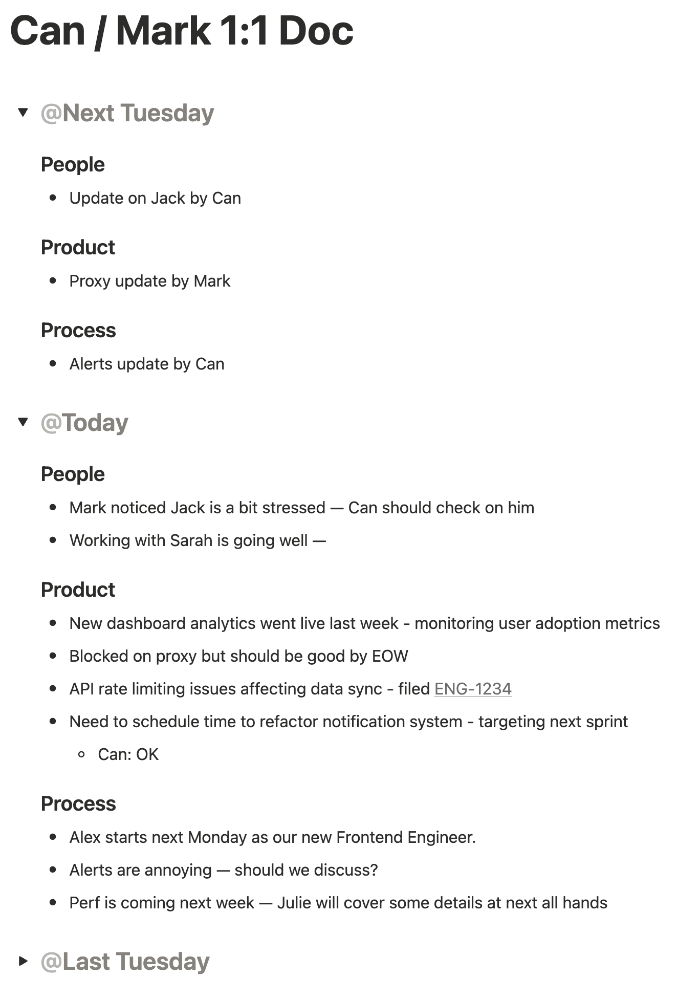

import Callout from '@/components/Callout.astro'

Most engineering managers know they're [supposed](https://rework.withgoogle.com/intl/en/guides/managers-research-behind-great-managers) to run 1:1s. Yet, many wing the format. I've seen too many 1:1s that meander, skip weeks, or devolve into status updates that could've been a Slack message.

Here's what works for me: a simple, repeatable structure that I use every single week. It's based on the popular **People, Product, Process** format (which I also use for [measuring engineering productivity](/posts/measuring-engineering-productivity)). I'm going to give you the exact script I use, the Notion setup, and some ideas for how to handle each section.

## Goals

Before we get into the mechanics, let's talk about what these meetings are actually for.

**Coaching**: You want to always give feedback to people. I use the format of a) what they're doing that they should keep doing, and b) what they're doing that they need to stop or change. You don't want to wait for perf sessions or annual reviews for most of this.

**Holding regular time**: This is important for both accountability and making sure we have time to catch things before they fester into larger issues (more on this later). Most problems don't just pop up, but they grow quietly. Regular, predictable meetings give you space to catch them early.

**Alignment**: You want to make sure you can steer people in the right direction for their own career growth and also with the company's goals. Are they working on things that matter? Are they developing the skills they want to build? Are they aligned with where the team is headed? Do they have a place to talk about their goals and see if they match what you can offer?

These three goals inform everything else about how I structure my 1:1s.

## Setup

### Scheduling

Hold these meetings weekly, at the same time, on the same day. Pay special attention to this. Frequency and stability matter more than you think. I want my reports to know I care about their 1:1s. It's on my calendar, it's on theirs, and it stays there. I resist the temptation to move 1:1s. **They should be treated as one of the highest priority items on your calendar, if not the highest.** In almost no circumstances should they be moved or missed. 

The same goes for reports: if someone wants to reschedule their 1:1, I tell them I'd rather keep it where it is and ask if there's a specific reason to move them. You don't need to turn it into an argument; often just mentioning that you want to keep it at the same time is enough. Just be aware that you can only demand the respect you show to others.

### Tooling

I use a shared [Notion](https://notion.so) document with each direct report. The format is simple:

- **H2**: The date of the 1:1 (e.g., "October 21, 2025"). You can use the `@today` shortcut in Notion for this.
- **H3**: The three sections: People, Product, Process
- **New entries go at the top** (reverse chronological)

<Callout variant="example" title="Notion Document Example" defaultOpen={false}>
  
</Callout>

This format gives you a running history. You can scroll down to see what you discussed last week, check if that thing got resolved, or verify that someone's actually making progress on what they said they'd work on. It also creates accountability for me: if I said I'd handle something, it's written down.

Another thing this format allows is automated reminders. As you're wrapping up this week's 1:1, create the H2 header for next week (again, Notion makes this easy) and drop in any forward-looking notes. For example: "Make sure the travel plans are ready for next week." Now you both have a reminder, and you can check it off together when you meet.

## The Intro

I always start with some version of "What's life been?" or casual small talk. This varies week to week depending on what's going on with the person. A home remodel? The Warriors game? Their boyfriend? Don't make it weird, but be personable. Keep it natural and genuine. This isn't part of the formal structure, but it sets the tone.

Then I transition into the framework.

## People, Product, Process

| Section | Opening Line | What You're Looking For | Red Flags |
|---------|-------------|------------------------|-----------|
| People | "How are things going with the team?" | Team dynamics, collaboration issues, interpersonal relationships | Repeatedly mentioning the same person negatively, vague complaints about "some people," avoiding specific names |
| Product | "What have you been working on last week?" | High-level work focus, progress on initiatives, blockers | Consistently nothing concrete, can't articulate what they worked on, same blocker week after week |
| Process | "Anything we can do to make you more productive or happier?" | Tool needs, process improvements, work-life balance, "company stuff" | Recurring complaints without follow-through, consistently "everything's fine" (might indicate lack of trust) |

### People

<Callout variant="tip" title="Opening Line">
    How are things going with the team?
</Callout>

This is intentionally neutral and open-ended. I want to know about team dynamics, interpersonal stuff, collaboration or communication issues. Anything related to people, really. Sometimes this leads to great conversations about who's doing well, who they're learning from, or who might need support. Sometimes there's nothing, and that's fine too.

I pay special attention to how people talk about their teammates. If someone keeps mentioning the same person—positively or negatively—that's worth noting. If they use vague language like "some people" or "the team," I'll dig gently to get into the specifics. Sometimes I'll flip the question: "Who's been great to work with lately?" or "Anyone you wish you were working with more?" If something needs action—like mediating a conflict or switching up team pairings—I follow up async after the meeting.

If I have a reason to believe there's something specific to discuss, I'll name names: *"How are things going with John Doe?"* Again, the wording is neutral. I'm not implying good or bad. I'm just making it clear that I know there's something there worth talking about. Often, invoking the name is enough to get the juices flowing.

### Product

<Callout variant="tip" title="Opening Line">
    What have you been working on last week?
</Callout>

First time managers obsess over task management. Don't make the same mistake. **The 1:1 is not a status meeting.** I'm not here to micromanage their Linear tickets. But I do want a high-level sense of what they're focused on, and I want it documented.

**Write it down. Visibly. In the shared doc. Right there, as they're talking.** The visceral, visual act of typing "Finished the API refactor" or "Debugged the CI pipeline issue" into a shared document creates a sense of accountability that you just don't get from checking Linear. They see you taking their work seriously. They see it's on the record, as it's getting recorded. Again, resist the temptation to just open a tab and go to Linear or Jira. Actually write stuff down, or at least copy it from the source of truth. Don't AI slop this.

I aim to make this section generally the smallest part of the 1:1. If they're stuck or blocked on something, I'll note it and ask if I can help—but I don't solve it in the 1:1 unless it's quick, on the order of 1-2 minutes. I also scroll down to last week's entry and sanity-check: "Last week you mentioned X, how'd that go?" If someone consistently has nothing concrete here, that's a yellow flag worth exploring separately.

### Process

<Callout variant="tip" title="Opening Line">
    Anything we can do to make you more productive or happier?
</Callout>

This is the grab bag, or _the meta_ section. The catch-all for everything that doesn't fit neatly into _People_ or _Product_. With some people, there's always something here. They want to try a new tool and need approval. They're going on vacation and want to give you a heads-up. They're frustrated with the deploy process and have ideas. Common topics include tooling, process complaints, meeting overload, work-life balance, and career development.

With other people, there's never anything. And that's okay too. I don't force it, but occasionally I'll prompt differently: "Anything slowing you down this week?" or "How's the balance feeling?" If there's a recurring theme—like "our deploy notifications are painful"—I escalate it (later). This is where you learn about systemic issues. I also use this section to plant seeds: "By the way, we're thinking about changing X—how would that land with you?"

Lastly, this section is useful to give people updates on company stuff. Things like an offsite coming up, new hires they should be aware of, or changes to team structure. It's a natural place for that kind of context-setting that doesn't fit elsewhere.

## Other Notes

### "The Career Conversation"

The enlightened (or conventional) wisdom says that 1:1 meetings should be mostly about career coaching. I don't disagree, but you can't always talk to your reports about their career. **A career is an artifact of the work as much as an aspiration.** You don't become an astronaut without becoming a Navy pilot or doctor first. And you don't become a doctor without doing years of residency, nor a Navy pilot without flying a Cessna. 

The good thing with having a routine like this is that it makes special conversations feel special. Ideally, every few months, you'll want to have a career oriented conversation with your reports. The ideal frequency is hard to pin down; it depends on people's roles (junior and very senior folks need it more often) and the company's trajectory. That conversation should feel different, and when you have to deviate from this routine, it will.

### Following Up

As I mentioned, most things should be handled async. If you're constantly finding yourself needing to take immediate action in 1:1s, that's a sign you're letting things fester. This is not advice specific to remote or async companies. **If you are always operating in interrupt-driven mode and running from fire to fire, you have other problems to fix first.**

The shared Notion doc helps here. If something needs follow-up, I'll either drop a note in next week's H2 header so we both remember to check on it, ping them async after the meeting with context, or escalate immediately if it's urgent (rare). Again, if you're always firefighting in 1:1s, something's broken upstream.

### Treat it With Respect

I mentioned this above but worth saying again: treat these meetings with respect. It's not just the right thing to do but the more respect you show for your reports, the more they will have your back.

Done regularly, these meetings will become your most important touch-points with your reports. They will judge you based on these meetings more than you think. They will go the extra mile for that deadline, or even thank you when you tell them it's not working out and have to let them go.

Do not reschedule them willy-nilly. Do not share your notes at any point with anyone; they should be private between you and your report. Do not gossip; just because someone said something juicy doesn't mean you should repeat it to anyone, even if it's fully true. Don't mention things you've heard from one 1:1 meeting to anyone else. Seems trivial, but it's human to want to connect with others using "gossip". Resist it.

## Routines are Good

I believe in routines. Not because they're rigid, but because they create space for the important stuff. When you have a script, you don't waste mental energy figuring out what to talk about. You can focus on listening, reading between the lines, and actually supporting your people.

The People/Product/Process framework isn't magic, nor unique. But it's consistent, it's comprehensive, and it works. It is _something_. Try it for a month. Use the exact same lines I use. Adjust as you learn what lands with your team.

And most importantly: write it down. Keep the history. Show them you're paying attention.
