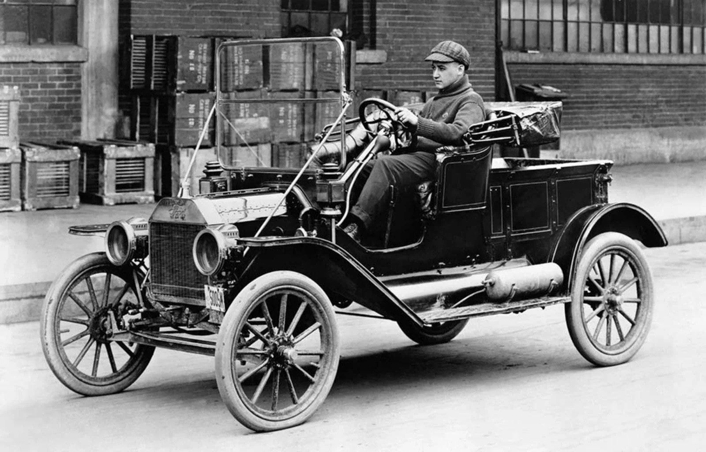
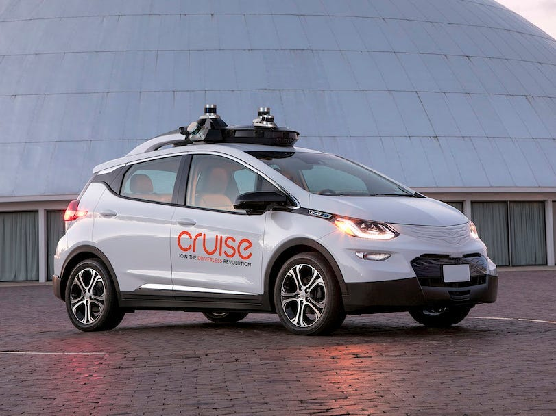

import Callout from '@/components/Callout.astro'

<Callout variant="note">
This post was originally published on [Margins](https://www.readmargins.com) in October 2019.
</Callout>

People occasionally put [me](https://twitter.com/can) on lists on Twitter, like "Brains" or "Good Tech Snark." I am not sure I deserve either title (#humblebrag). I generally try to be more satirical than snarky. Given the antics of my industry, I admit, the line is blurry. You can sometimes simply repeat people's statements verbatim, and they come out like I am making fun of them. Snark, in my mind, has a negative connotation. That's not to say I don't miss the mark, and I appreciate people calling me out when I am not respectful or just not interesting or insightful. You know who you are.

Anyway. A common not-so-insightful (insightless?) joke schema I often see on Twitter is the "Foobar! You invented foobar!" tweet. I am sure you've seen it. Generally what happens is that some company launches a new product with some tech twist in an existing industry, there's some overly flattering coverage on the usual suspects, and someone from the tech-snark Twitter goes to tweet "Book Reports! You invented book reports" with some gotcha screenshots.

Obviously, before I go any further, some disclaimers are in order. The [tweet-zero](https://x.com/joshbutler/status/847189801967132672) for this phenomenon seems to be aimed at Lyft when they launched the Lyft Commuter Shuttle service:

<blockquote class="twitter-tweet">
That&#39;s a bus. You invented a bus. <a href="https://t.co/eUWRwXH9Tp">https://t.co/eUWRwXH9Tp</a>
&mdash; Josh Butler (@joshbutler) <a href="https://twitter.com/joshbutler/status/847189801967132672?ref_src=twsrc%5Etfw">March 29, 2017</a></blockquote> 

I didn't work at Lyft, but I did at Uber. I still hold some Uber stock. I (mostly) toiled on the authentication team, so I wasn't involved much in the vast array of transportation options we provided. I am sure, however, Uber was the target of this school of analysis-cum-snark often. Probably more than most other companies. So, you can ascribe all my bitterness to sheer annoyance.

One thing that's now become fashionable in tech analysts' circles is to wonder what makes a tech company a tech company. I have written about this before, multiple times, as have Ben Thompson, Benedict Evans, and probably many others whose names aren't Ben or Can. It's a fun thought exercise and does lend itself to putting a lot of words on paper. Yet, the more I think about it, I am less convinced it's a good way to come up with, say, an investment thesis that allows for making testable predictions.

Of course, the "X, you invented X" format isn't always about saying the same thing as "this isn't a tech company." Sometimes, reasonable people argue that companies come into new industries after raising obscene amounts from gullible investors under the guise of being a tech company, and with their irrational subventions, undercut the honest businesses. That is a valid concern. Luckily, I guess, is that those gullible investors are slowly learning that companies should make money. Who knew?

Yet, faux-inventor-decrying misses an essential point in what counts as innovation. **Most of what we think of innovation is really business model innovation, rather than technology innovation.** We are more easily amused and excited by the latter, but what changes our lives more often is the former. Business model innovations rarely capture the imagination of the masses or present well on short time-horizon focused mediums, say Twitter, but they matter.

## The Visceral vs. The Valuable

Some of this is human. Technical innovations have a more visceral, visual quality that bamboozles everyone, including yours truly. I still remember, for example, the moment Steve Jobs showed the rubber-band UI on the iPhone, where the screen kept moving after he lifted his finger. I mean, it wasn't like the man invented the lightbulb, but having been a UI-focused software engineer at the time, I knew something changed forever. Same with driving cars; living in San Francisco, I still smile a bit when I look inside a Zoox or Cruise car and see the person not holding the wheel. This stuff is fun.

Yet, many technology innovations fail to make it past the showroom stage. Often, it's because they are neat tricks, but they don't solve real problems. Or they are useful, but not just as helpful, or for enough people, so they find new lives. Those innovations can, for example, become niche players. Segway is a good example. We did not end up rebuilding cities around "Ginger" as it was previously known, but they did become the vehicle of choice for mall cops everywhere. That's more success than most companies could ever hope for, but still a bit of a shorter throw than an urban renaissance.

## The Model T Lesson

The token business school example for business model innovations is Henry Ford's Model T. Famously, Ford, an engineer and an accountant by trade, wasn't the first to come up with the automobile, nor the moving assembly line. Yet, he (or his employees, the history is a bit murky here) had the insight that you could build automobiles that way, and the rest is pretty much history. The Model T is a testament to the idea of business model innovation, where you take out parts of what works in other businesses, rewire them in some fashion and make a ton of money and create something new much more cheaply.

The line between business and technology innovation is also pretty hard to draw, and most of the analysis here is done after the fact. For example, Google is probably the most technical of the technology companies per collective imagination. I am leaving aside the "Well, actually, Google is actually an advertising company" responses here, which is a valid but not a relevant point. If you take apart what makes Google Google, you'll see it shares much more with what you'd call business model innovation.

One of the Google founders' earlier insights was that if you wanted to show the most relevant results at the top, you could use the [number of pages that link](https://en.wikipedia.org/wiki/PageRank) to it as a signal. I am not sure how much of this is true, but the folklore says that they were inspired by how, in the scientific community, the number of citations a paper gets is a strong signal of quality. But that's hardly the only thing Google did right, or "borrowed" from somewhere. Google found new pages to index by crawling, an idea that was popularized by Lycos (Go [Tartans!](https://en.wikipedia.org/wiki/Lycos)). And its real moneymaker to this day, Adwords, that shows ads related to the search terms, was heavily inspired by Overture.

## Software Eating the World

People make fun of the "[Software is eating the world](https://a16z.com/why-software-is-eating-the-world/)" adage often, partly because of how breathlessly a16z folks repeat it. Like, it's right next to their logo on their website. Of course, it's an oversimplification ("Wildly reductionist!", in smart dude Twitter parlance) of a complex phenomenon, but that's how slogans and taglines work. You forego some edges and complexities, so they roll off the tongue. More importantly, I also think it's often used as a justification to be dispassionate and inconsiderate.

Yet, the crux of the phrase does ring true. I am cringing as I write this. "Atoms are responsible for everything; from BLTs to moms everywhere", says this [Uber promo video](https://vimeo.com/153905859). But, really, as more atoms turn into bits and more bits control atoms, we will inevitably see more business model innovations that will look like someone re-inventing something. There's a model of looking at a company like Uber as primarily regulatory arbitrage, which I do not fully endorse, but I do acknowledge. But even if that specific company gets regulated away tomorrow, there's no going back to a world where, in sterile economist-cum-technical jargon, there's no price discovery of transportation from point A to point B, all done on a centralized system with mobile devices. **Something has changed. The business model innovation, built on generally boring technologies, stuck.**

We sometimes talk about margins here, somewhat unsurprisingly. Computers, internet, smartphones; whatever revolution you want to attribute it to, lowered the margins in most things information related to virtually zero. This meant what used to be prohibitively expensive to build and deploy became possible. Yet, basic human needs remain the same. We still want to move around, socialize, nourish ourselves, feel loved, and such. What comes out often will be rewiring some old business ideas with some new technologies. It is no wonder that, many times, things will look like us re-inventing something with technology.

## Looking Through Historical Lenses

Most people who analyze things for a living have some lenses they look at the world through. For some, it is competition. When they look at a company, they see how it compares on some dimensions to its competitors. Some others have a more chaotic view of the world and think that companies generally live or die based on exterior factors, so they focus more on the industry and the macro trends. Obviously, I am not as much of an analyst, but rather an amateur rambler. But I look at companies and products from a historical perspective. Things happen, in other words, because other things happened before them. When you have this view, what you see is how often things repeat. There's very little new under the sun; I like to say.