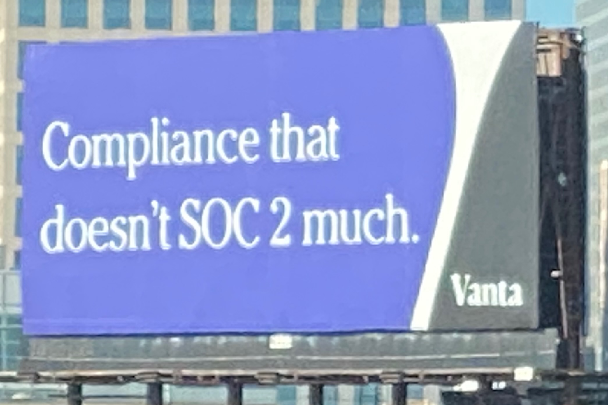
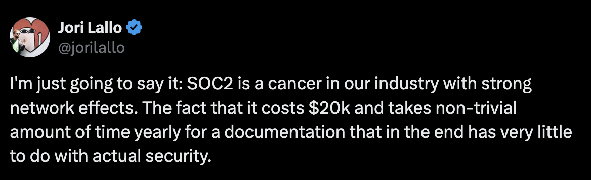
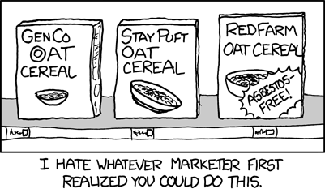

import Callout from '@/components/Callout.astro';

<Callout type="info">
This article was originally published on [Margins](https://www.readmargins.com/p/the-soc2-kabuki-theater) on July 31, 2025.
</Callout>

Working at a small tech company has perks. You want to fix a bug? Push a change to production. A user has problems? Connect to the database and look up, and hopefully fix, their data.

Large firms work differently. When you are a large enterprise, you promise your customers that the product won't change under them and that their data won't be snooped on. It's why they have large customers and large sums of money.

So what do you do as a small company when you want to sell your product to a large company? How do you bridge that trust gap? Well, these days, you check your bank balance and then call up Vanta to ask about SOC2.

In related [news](https://www.cnbc.com/2025/07/23/crowdstrike-backed-vanta-is-valued-at-4-billion-in-new-funding-round.html), Vanta just raised a bunch of money:

> Vanta, a startup with software for managing compliance with cybersecurity and privacy standards, said Wednesday that it closed its latest fundraising round at a roughly $4 billion valuation.
>
> The $150 million round, which included funding from [CrowdStrike's](https://www.cnbc.com/quotes/CRWD/) venture arm, represents a valuation increase from $2.45 billion last year.

## What is SOC2, anyway?

SOC 2 is essentially a way to tell people that you have undergone certain security checks. You hire an auditor, who gives you a huge spreadsheet and tells you to start acting like an adult. You start doing criminal background checks on employees, write up all sorts of policies (all the way from password rotation policies to what happens if your CTO gets stranded on a remote island), tighten up the security of your data, code, and a bunch of other stuff. It's a lot, and it feels like it won't ever end. You put all that into the spreadsheet over the course of weeks, or even months.

If the auditors like what you've put into the spreadsheet, you get a Type 1 certificate, which is more of an IOU. What you really want is the Type 2 certificate, which requires a 6-month wait. During this "observation period", the auditors continuously check if you've been following your own procedures. Then, if they are convinced, you get the Type 2 certificate as a fancy PDF. You put the SOC2 logo on your website, write a blog post, and tell all your prospects you are now a secure company. And, of course, the observation period starts again. The cycle continues.

OK, this is a funny billboard.

So, where does Vanta fit in all this? They make and fill in the spreadsheet for you.[1] As "the compliance automation platform", they sit between your company, "the service organization," and the auditors. Auditors look at the spreadsheet created by Vanta and give you a pass/fail score.[2]

The "tech" angle behind all this is connecting to all your systems like AWS and Github and verifying things are locked down. Vanta also syncs up with your HR systems like Google or Workday to make sure people follow their training schedule, accept their policies, and pass their criminal checks. It's a big value add for Type 1, and a true lifesaver for Type 2.[3]

Now, in a pure business sense, Vanta should be good for the world. If they are lubricating the wheels of commerce by making sure even small companies can [cross the enterprise chasm](https://www.youtube.com/watch?v=6MSYAndGwMg), it's fair for them to get a cut of the marginal transactions they are enabling. After all, that's why most SaaS companies exist. We all make the world a better place, in our small ways.

There's, however, a cynical view that SOC2 (and other compliances) is essentially now a tax that you have to pay. You do it not because you have to, or because it makes your product more safe and secure, but because the industry undertow makes you do it. With a conservative 20x multiple, Vanta could be making $200M a year. What percent of that is the enterprise value their customers have created that they are capturing, and what percent is just a tax?

Linear co-founder (via [x](https://x.com/jorilallo/status/1752783996826665257))

## Problems with SOC2

First, the perverse incentives and the pay-for-play. The auditors work for you, the client. It's in the auditors' interest to keep you happy, so it doesn't take a lot to convince them you are doing the right thing. The enterprise customers often don't even know who the auditors are before seeing the SOC2 report, because seeing the report requires an NDA. And these customers rarely, if ever, choose their vendors based on their auditors, if they ever read the report at all. Having read a few SOC2 reports for my company's vendors, I can tell you the quality of reports, and the security postures, vary wildly. And, needless to say, no one cares if the product is good but the report is bad.

That's an excellent [title](https://fly.io/blog/soc2-the-screenshots-will-continue-until-security-improves/)

Second, the entire process is incredibly janky. A shocking amount of the SOC2 process is built on [screenshots](https://fly.io/blog/soc2-the-screenshots-will-continue-until-security-improves/). If that sounds extremely insecure, you are correct. You take screenshots of your tools. You take screenshots of your JIRA tickets. Whatever you need to "prove," you take a screenshot and upload it to Vanta as evidence. The word "evidence" belies a forensic approach, but it's a lot more TSA checkpoint than actual detective work. There's no chain of custody, authentication, or anything. The entire system largely hinges on your auditor's trust in your screenshots.

Third, the network effects. The entire thing spreads [like a virus](https://x.com/alon/status/1752823377323327899) in the system, in two ways. First, it's via the technical dependencies embedded in the SOC2 process. Even the smallest of SaaS companies run on other SaaS companies' products[4]. In order to get your auditors' approval for SOC2, you end up having to validate all your vendors' security practices. You can already see where this is going. That, of course, also requires you to get their SOC2 certificate. Turtles all the way down!

via [xkcd](https://xkcd.com/641/)

And then, more subtly, there's the social pressure. Sure, SOC2 makes your company more secure. But ultimate security is an elusive, platonic ideal. No company with SOC2 is immune to a rogue employee or a dedicated hacker. Things always slip through the cracks.

However, with everyone around you getting SOC2, your investors being investors in various players in the ecosystem like Vanta, the FOMO to "just get SOC2 and be done with it" is immense and hard to argue against. Not only that, it comes earlier and earlier in companies' lifecycles now. Companies without product-market fit or even a sales team spend weeks on SOC2. Is that the best use of anyone's time, or are we just watching a very elaborate Kabuki theater?

SOC2 is serious business

## It's Just Business

Look, this is not to say that Vanta is a bad actor. It's a hugely successful business. And clearly, [many people](https://x.com/tferriss/status/1885831142718275698) love it. I know lots of great people who work there. And I keep mentioning them as a placeholder for this industry because they are the leaders.

Making it easy to get SOC2 earlier in a company's lifecycle is a [great idea](https://x.com/christinacaci/status/1948424965285666921). A company that has a security mindset earlier on is going to be a Fort Knox compared to a large company that bolts on a bunch of policies later on. It'll also be more pleasant for everyone, and cheaper. These are undeniably good things. Any time technology makes something hard easier, I err on the side of celebrating that.

Not only that, I know people who have _had to_ get their SOC2 before Vanta, and those people would have killed to have the automations and integration tools that Vanta provides. It's a clear value-add for those who [need](https://x.com/ejzim/status/1948440664804655608) it. It's a lot more fun to click buttons than to fill in those spreadsheets.

Yet, in this case, I am not convinced the tech industry has become better thanks to our newfound love for SOC2. Vanta is not a villain, but they aren't heroes either. Currently, they are the enablers of a flawed system, not unlike TurboTax and the IRS.

Ask yourselves. Are we all more efficient at sales and go-to-market now that we are all SOC2 certified? Are everyone's products safer as a whole? As a customer, have you ever checked if an app you are using is SOC2 certified? As a professional, did seeing SOC2 on your vendors' security page give you more confidence, or did you just feel good about CYA?

What many won't tell you is that the real secret to SOC2 is less about using the right platform and more about finding an agreeable auditor. Like I alluded to before, most SOC2 reports aren't read. If a company wants to use a vendor, and their vendor's report is awful, it won't stop them. But everyone's stuck doing the right thing, even when it's the wrong thing.

## Breaking the Screenshot Tax

The irony is thick. Small companies used to sell the dream of being a cowboy: pushing to production, fixing problems directly, moving fast. Then we built tools to help small companies act like big companies so they could sell to big companies. Now those same small companies spend their precious early days filling out compliance spreadsheets instead of finding product-market fit. Where did the fun go?

It is now time to replace SOC2 with something better[5]; something continuous, programmatic, and discrete. A compliance scheme that monitors security in real-time, just like we monitor our apps. One that updates automatically when you fix a vulnerability, not six months later when the auditors check back in. The good thing is Vanta now has both quite a bit of leverage and expertise on both sides of this market. They have the integrations, the customer base, and now $150 million in fresh capital. They should use [their powers](https://x.com/christinacaci/status/1948439197897163077) (and new coffers) for good. Enterprises won't like giving up their familiar PDFs, but someone has to drag them into the 21st century.

The same ingenuity that created this compliance-industrial complex can tear it down. We've already transformed how we build and deliver software—from waterfall to agile, from shrink-wrap to SaaS, from annual releases to continuous deployment. We monitor our systems in real-time instead of waiting for post-mortems. We scan for vulnerabilities continuously instead of scheduling yearly pen tests. Hell, we even moved from PDF manuals to living documentation.

So why are we still treating compliance like it's 1995? Imagine getting dinged for a security issue you fixed three months ago, just because the auditors haven't caught up. Or passing your SOC2 while harboring vulnerabilities that appeared yesterday. It's time to ship the future of trust, not just automate the past. All that's missing is our collective will to stop paying the tax so I can go back to pushing code to prod.

---

[1] Unsurprisingly, a hand-woven [spreadsheet](https://review.firstround.com/vantas-path-to-product-market-fit/) was also the first version of Vanta.

[2] In reality, it's a lot more of an interactive process with a whole lot of back and forth convincing your auditors. On one hand, it's a lot more human than I imply. On the other, it's really about who you know.

[3] I have used a Vanta competitor, Drata, but they were largely the same. I did get a two-week demo of Vanta as well.

[4] I have mixed thoughts about it. It's always good to have a bunch of people who can bootstrap your business, but it can definitely hide the real challenges. Not even going into the circular trading nature of increasing ARR, however.

[5] Beat you to [it](https://xkcd.com/927/).
